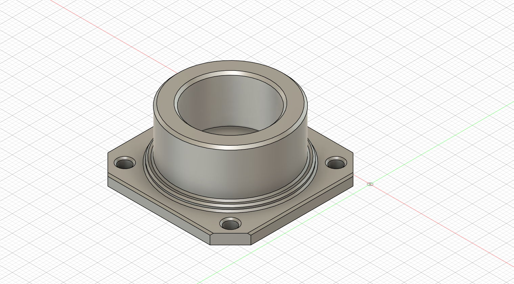
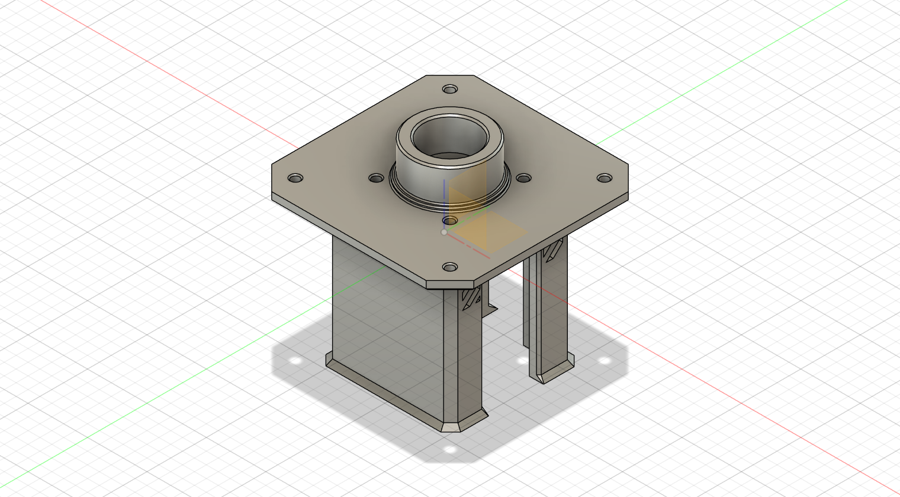
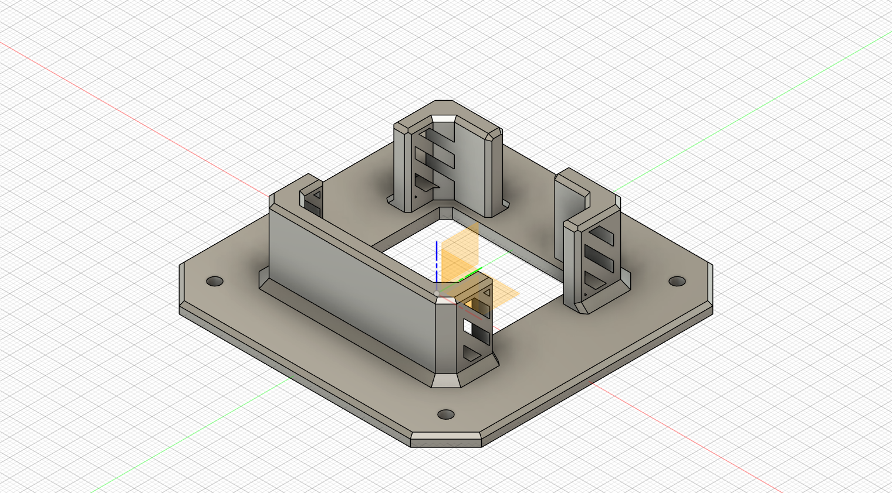
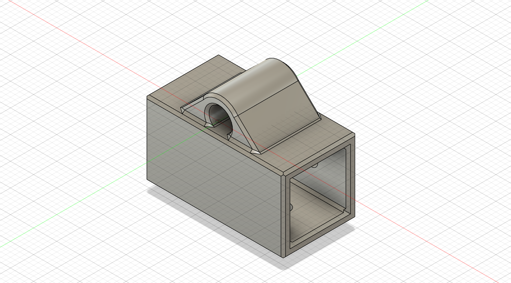

# 步进电机云台

基于 [B站-朱庇特Zeus](https://www.bilibili.com/video/BV1ha4y1Q7Wy) 大佬作品修改，适配张大头闭环步进开发板

## 工程文件

Fushion 360

 [Part 1.f3d](Part 1.f3d) 

 [Part 2.f3d](Part 2.f3d) 

 [Part 3.f3d](Part 3.f3d) 

 [Part 3 -  Suspended type.f3d](Part 3 -  Suspended type.f3d) 

 [Part 4.f3d](Part 4.f3d)

### 3mf

 [Part 1.3mf](Part 1.3mf) 

 [Part 2.3mf](Part 2.3mf) 

 [Part 3 吊式 上半部分.3mf](Part 3 -  Suspended type - 1.3mf) 

 [Part 3 吊式 下半部分.3mf](Part 3 -  Suspended type - 2.3mf) 

 [Part 3 座式.3mf](Part 3.3mf) 

 [Part 4.3mf](Part 4.3mf) 

## 效果图

### Part 1

### Part 2

### Part 3

吊式，需要分开打印

### Part 3

座式

### Part 4

